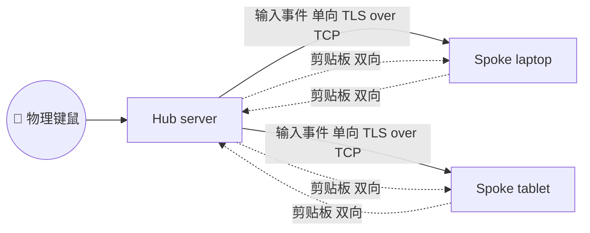

# borderless

一个仅在局域网内工作的、跨平台的 **键盘 / 鼠标 / 剪贴板 共享工具**，C/S 架构（Hub + Spoke），类似 Synergy / Barrier / Input Leap。

> v0.2 起，通讯底座为 **TCP + TLS（rustls）+ Ed25519 应用层签名**。一个 Hub 服务端
> 接受多个 Spoke 客户端连接；物理键鼠在 Hub 上输入、单向广播到 Spoke；剪贴板在所有节点之间双向同步并由 Hub 中转。

## 当前状态：v0.2

已可用：

- 完整的 Cargo workspace，9 个 crate
- TCP + rustls TLS 1.3 传输，节点身份用持久化的 Ed25519 长期密钥
- TLS exporter 绑定的应用层 SignedHello —— TLS 不被信任，真实身份由签名校验
- TOFU 首次配对 + Short Authentication String 比对
- 文本 + 图片剪贴板同步：>256 KiB 走 BLAKE3 寻址的懒拉取
- 完整的平台抽象层（PAL）+ HID Usage 中转：
  - **X11**：XInput2 捕获 + XTest 注入（已实装）
  - **Windows**：`WH_KEYBOARD_LL` / `WH_MOUSE_LL` 钩子捕获 + `SendInput` 注入（已实装）
  - **macOS**：CGEventPost 注入 + `AXIsProcessTrusted` 权限自检（注入实装；CGEventTap 捕获骨架已就位，完整 RunLoop 走 v0.3）
- `borderless serve` / `borderless connect` / `borderless status` / `borderless doctor` / `borderless clip {set,get,history}`
- 角色感知的 doctor 检查（Hub 检查端口绑定 + 防火墙提示；Spoke 检查可达性）
- GitHub Actions CI：fmt + clippy + 三平台 `cargo test`，Linux 端经 `xvfb-run` 拉起虚拟 X 显示

尚未实现：

- 真正的「跨边界」UX（v0.2 走 Hub-only-active，物理输入由 Hub 设备提供并单向广播；spoke 不再做本地捕获）
- macOS CGEventTap 完整捕获 RunLoop（v0.3）
- Wayland 后端
- 文件剪贴板、跨设备拖拽
- 图形界面

## 架构总览



详细设计见 [docs/architecture.md](docs/architecture.md)，线上协议见
[docs/wire-protocol.md](docs/wire-protocol.md)。

## 快速开始

需要 Rust 1.75+（用 [rustup](https://rustup.rs/) 安装，不要用 `apt install cargo`）。

```bash
cargo build --workspace
cargo test  --workspace
```

部署一个最小 1 Hub + 1 Spoke：

```bash
# 在 Hub 端
borderless serve --bind 0.0.0.0:38437 --accept-new-peers

# 在 Spoke 端（首次配对加 --pair）
borderless connect 192.168.1.10:38437 --pair

# 之后 Spoke 端无参数 connect 即可，地址已持久化到 config.toml
borderless connect
```

`borderless status` 查看自身 NodeId、角色、对端清单；
`borderless doctor` 自检平台权限、防火墙端口、可达性等。

### 配置文件

第一次运行 `borderless serve` 或 `borderless connect` 时会自动在
配置目录下生成 `config.toml`（路径见下表）。如果想离线先编辑好，
仓库里 / release tar 包里的 `examples/` 下提供两份带注释的范例：

| 角色 | 模板 |
|---|---|
| Hub | [`examples/config.hub.toml`](examples/config.hub.toml) |
| Spoke | [`examples/config.spoke.toml`](examples/config.spoke.toml) |

把对应模板复制到下面这个路径再启动即可：

| 平台 | 默认配置目录 |
|---|---|
| Linux | `~/.config/borderless/config.toml` |
| macOS | `~/Library/Application Support/io.borderless.borderless/config.toml` |
| Windows | `%APPDATA%\borderless\borderless\config.toml` |

也可以用 `--config-dir <DIR>` 或 `BORDERLESS_CONFIG_DIR` 环境变量覆盖。

启用项目内的 git 钩子（commit 前自动 fmt + clippy，避免 CI 红灯）：

```bash
git config --local core.hooksPath scripts/hooks
```

完整的开发工作流、CI/Release 流程、代码风格、提交信息约定见
[CONTRIBUTING.md](CONTRIBUTING.md)。

## 跨平台说明

- **Linux/X11**：链接 `libxtst-dev` `libx11-dev` 头文件；运行时需要 `DISPLAY` 指向有效 X 服务器。
- **Linux/Wayland**：v0.3 计划支持，依赖 GNOME 46+ / KDE 6+ 的 `org.freedesktop.portal.InputCapture`。
- **macOS**：键鼠注入需要 *系统设置 → 隐私与安全性 → 辅助功能 + 输入监控*；运行 `borderless doctor` 查看清单。
- **Windows**：首次启动会触发 TCP 防火墙弹窗，请在私有网络放行。

### macOS 首次运行：放行 Gatekeeper

我们目前发布的 macOS 二进制**没有 Apple Developer 证书做代码签名和公证**，
因此从 GitHub Releases 下载后，macOS 会弹出
*"Apple 无法验证 'borderless' 不含恶意软件"* 并阻止运行。

按以下任一方式放行：

1. **从源码本地编译**（最干净）：
   ```bash
   git clone https://github.com/NexF/borderless.git
   cd borderless && cargo build --release
   ./target/release/borderless doctor
   ```

2. **删除下载文件的 quarantine 标志**：
   ```bash
   xattr -dr com.apple.quarantine /path/to/borderless
   ```

3. **系统设置里手动放行**：
   双击二进制 → 拒绝弹窗 → *系统设置 → 隐私与安全性* → **"仍要打开"**。

## 目录结构

```
crates/
  core/            协议数据类型，无 IO
  transport/       TCP + rustls + Ed25519 + TOFU
  pal/             平台抽象 trait
  pal-x11/         X11 后端（XInput2 + XTest）
  pal-windows/     Windows 后端（低级 hook + SendInput）
  pal-macos/       macOS 后端（CGEventTap 骨架 + CGEventPost）
  clipboard/       版本化快照 + 历史环 + 懒载荷
  input-router/    虚拟屏幕拓扑（v0.3 起接入）
  cli/             borderless 二进制
docs/
  architecture.md  架构总览
  wire-protocol.md 线上协议参考
examples/
  config.hub.toml    Hub 角色范例 config（可直接复制到配置目录）
  config.spoke.toml  Spoke 角色范例 config
```

## Release 包结构

GitHub Releases 上的 `borderless-<target>.tar.gz` / `.zip` 解开后是：

```
borderless-<target>/
  borderless         # 主二进制（Windows 下为 borderless.exe）
  README.md
  examples/
    config.hub.toml
    config.spoke.toml
```

## 协议许可

MIT 或 Apache-2.0，二选一。
