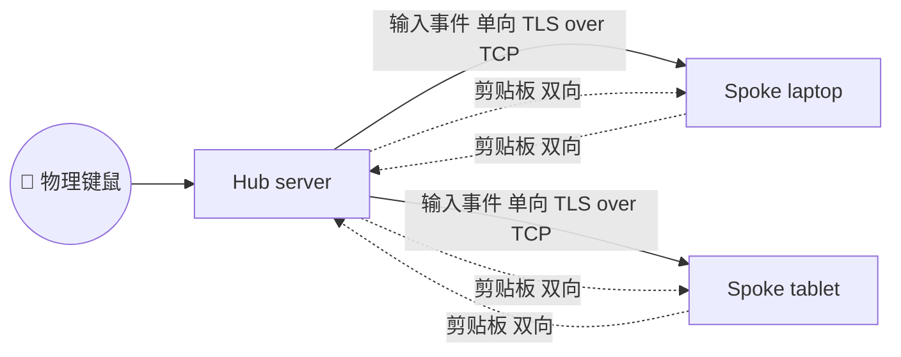

# 架构（v0.2）

## 顶层模型

`borderless` v0.2 是经典的 **C/S（Hub + Spoke）** 网络：

- **Hub（服务端）**：唯一绑定 TCP 监听端口的节点，物理键鼠输入的来源。
  Hub 也充当所有 Spoke 之间剪贴板事件的转发中心。
- **Spoke（客户端）**：主动 dial Hub 的节点。Spoke **不**捕获本地物理输入
  （Hub-only-active 决策），但会接收 Hub 推过来的 `WireFrame::Input` 并注入到本机；
  剪贴板与 Hub 双向同步。



每条 Hub ↔ Spoke 连接是一条 **TCP + TLS** 流，承载所有消息：输入事件、
剪贴板快照、控制帧、大对象懒拉取请求/响应。统一的帧格式：
`u32-LE 长度 || postcard 编码的 WireFrame`。

## 设计不变量

- **物理输入只能从 Hub 流向 Spoke**。运行时收到 Spoke 上来的
  `WireFrame::Input` 一律记日志后丢弃（防御协议级误用 / 故障）。
- **修饰键状态随 `Key` 帧的 `modifiers` 字段同行**。即使在跨节点序列中按住 Shift，
  接收端也总是知道当下应当持有的修饰键状态。`Enter`/`Leave` 是为 v0.3 的
  虚拟屏幕拓扑预留的边界事件。
- **鼠标位移以 `(dx, dy)` delta 形式发送**，不传绝对坐标。
  这样跨 DPI / 跨分辨率不需要做坐标系换算。
- **剪贴板快照携带 `origin` 与 Lamport `version`**。
  收到来自自身的快照，或版本号 ≤ 本地已发布版本的快照，一律丢弃。
  这条规则消灭了朴素同步工具常见的 A↔B 回声死循环。
- **大于 256 KiB 的剪贴板项只发元数据**。接收端在真的执行"粘贴"时，
  通过 BLAKE3 哈希向源端发 `WireFrame::FetchRequest`，对端用一组
  `WireFrame::FetchResponse(chunk_idx, total, bytes)` 分块回复。

## 数据通路

```
                        Hub                                Spoke
                  ┌──────────────┐                  ┌──────────────┐
                  │  PAL Capture │                  │              │
   物理键鼠 ────→ │              │                  │              │
                  │      ↓       │                  │              │
                  │  Input frames│ ── TLS over TCP →│  PAL Emit    │── 注入 OS
                  │              │                  │              │
                  ├──────────────┤                  ├──────────────┤
                  │ ClipboardEng │ ◀── 剪贴板帧 ──→ │ ClipboardEng │
                  │   广播给所有  │                  │              │
                  │   其它 Spoke  │                  │              │
                  ├──────────────┤                  ├──────────────┤
                  │  LazyStore   │ ◀── Fetch ──── │  按需拉取     │
                  └──────────────┘                  └──────────────┘
```

## 威胁模型（v0.2）

主要场景：**局域网内的两到几台桌面设备**，由信任彼此的同一用户拥有。
被动监听者（同一 Wi-Fi）不在受信范围内。**不**在威胁模型内的：
已经 TOFU 配对的恶意 peer、国家级攻击者、侧信道攻击、Hub 操作系统被攻陷。

缓解措施：

- 强制 TLS 1.3（rustls + ring 后端），TLS 证书是 ECDSA P-256 自签短期证书；
  TLS 不被信任作为身份层。
- 真实身份建立在 TLS 之上：每端发送一个 `SignedHello`，签名内容是
  `borderless/hello/v0 || tls_keying_material`，使用 Ed25519 长期密钥。
  这样即使 TLS 层被中间人替换，对方也仍需 Ed25519 私钥才能伪造合法 Hello。
- TOFU 首次配对：第一次握手成功时把对端 Ed25519 公钥指纹写入 `known_peers.toml`，
  以后必须指纹一致。
- 配对模式提供 SAS（双方屏幕显示一个 6 位数字，从 TLS exporter 派生）供口头比对；
  默认严格模式则需要预先用 `--accept-new-peers` 手动配对。
- `connect --pin <pubkey>` 允许 Spoke 端钉死 Hub 公钥，零 TOFU 信任假设。
- 注意：**Hub 自然能看到所有 Spoke 的剪贴板内容**（剪贴板由 Hub 中转）。
  这是 C/S 拓扑固有的属性；如果不接受，请勿使用 borderless。

## 网络选型理由（为何不用 QUIC / mDNS）

v0.1 用 QUIC + mDNS 时遇到了两类持续问题：

- **mDNS 在路由器/防火墙下被屏蔽** 是 LAN 工具的常见痛点；改成手动配置一次性问题。
- **QUIC 自动分配的 socket、scope_id、IPv6 link-local 地址** 在桌面机的多网卡环境下经常出错。
- QUIC 流多路复用对 borderless 的消息量来说**没有实际收益** —— 我们一秒最多
  几百帧、单帧不超过几 MB，TCP 头阻塞在 LAN 上感知不到。
- TCP + rustls 的实现复杂度低 5×，调试链路一致性强。

代价：失去 0-RTT 重连和数据报通道。在 LAN 内重连一次的代价是 ≤ 100 ms，
完全可接受；输入事件改走 TLS 流也仍稳稳低于 5 ms。

## 性能目标（作为 v1.0 的验收基准）

| 指标                | 目标       |
| ----------------- | -------- |
| 鼠标端到端延迟（同 LAN，有线） | < 8 ms   |
| 键盘端到端延迟           | < 10 ms  |
| 文本剪贴板同步           | < 50 ms  |
| 1 MB 图片剪贴板同步      | < 200 ms |
| 空闲 CPU 占用         | < 0.5%   |
| 常驻内存占用            | < 30 MB  |

## 模块依赖

```
borderless-cli ─── borderless-transport ─┐
       │                                 │
       ├── borderless-clipboard ─────────┤
       ├── borderless-input-router ──────┤
       ├── borderless-pal ───────────────┤
       │                                 │
       ├── borderless-pal-x11 ───────────┤
       ├── borderless-pal-windows ───────┤
       └── borderless-pal-macos ─────────┘
                                         │
                                         └─── borderless-core
```

`borderless-core` 是叶子节点：纯数据类型、无 IO，所有上游 crate 都依赖它。
